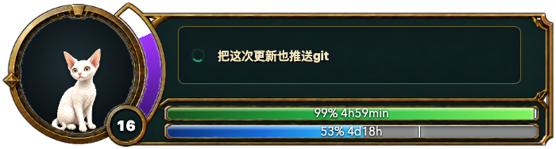
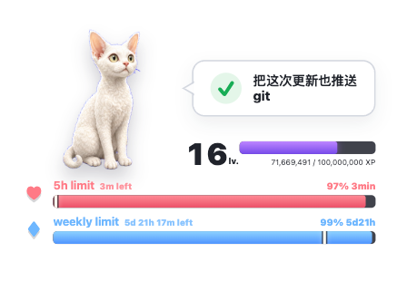

# Codex Usage Pet

一个 macOS 顶层悬浮小窗口，用来展示本机 Codex 的用量、限额、当前任务状态和动画宠物。

应用读取本机 `~/.codex` 下的 Codex session 日志，不需要额外服务。为了让等级正确使用个人累计 Token 数，建议首次安装后执行一次个人资料刷新定时任务，它会通过本机 Codex 登录态生成并定时更新 `profile-stats.json`。

## 更新提示：v0.1.1（2026-07-10）

近期 Codex Desktop 更新了本机 session 日志行为：多个限额通道、guardian/subagent 会话可能同时写入日志，新版工具活动也开始使用 `custom_tool_call` 和 MCP 事件。旧版 Codex Usage Pet 因此可能一直显示 `100%`、重置倒计时长期停在 `5h` / `7d` 附近，或把其他任务和审批会话误认为当前任务。

`v0.1.1` 已完成以下兼容调整：

- 固定优先读取标准 `codex` 限额通道，避免辅助通道的零用量覆盖真实数据。
- 选择当前任务时排除 guardian 和 subagent 会话。
- 支持新版 `custom_tool_call`、`custom_tool_call_output` 和 MCP 工具事件。
- 当最新消息只是“允许”“继续”“确认”等审批回复时，保留原任务标题。
- 增加多会话限额选择和活动状态回归测试。

建议所有现有用户更新并重启应用：

```bash
cd codex-usage-pet
git pull --ff-only
npm install
npm test
npm start
```

如果悬浮窗口已经打开，请先退出再启动新版本，因为日志读取模块由 Electron 主进程加载。

## 功能

- 顶层悬浮窗口，显示在所有桌面。
- 显示 5 小时限额和 weekly 限额。
- 显示重置倒计时、剩余百分比和进度条游标。
- 读取当前 Codex session，显示正在执行的任务。
- 支持 Devon 宠物 spritesheet 动画。
- 支持拖拽移动窗口和右下角调整大小。
- 支持每小时自动刷新个人累计 Token 数。

## 皮肤

应用内置两套皮肤，可在右上角按钮中切换：

### 游戏风格



### 简约风格



## 环境要求

- macOS
- Node.js 和 npm
- 本机已有 Codex 数据目录 `~/.codex`
- 默认 White Devon 宠物文件已内置在 `assets/white-devon/spritesheet.webp`

如果是在 Codex Desktop 的受控 shell 里操作，系统 PATH 里可能没有 `node` / `npm`。这种情况下可以使用 Codex 自带的 Node.js 和 pnpm，见下方“无 npm 的安装方式”。

## 安装

```bash
git clone https://github.com/guo842400579-beep/codex-usage-pet.git
cd codex-usage-pet
npm install
```

### 无 npm 的安装方式

如果当前 shell 提示 `npm: command not found`，但机器上安装了 Codex Desktop，可以先把 Codex 自带运行时加入 PATH：

```bash
git clone https://github.com/guo842400579-beep/codex-usage-pet.git
cd codex-usage-pet
export PATH="$HOME/.cache/codex-runtimes/codex-primary-runtime/dependencies/node/bin:$HOME/.cache/codex-runtimes/codex-primary-runtime/dependencies/bin:$PATH"
pnpm install
pnpm rebuild electron
```

仓库内已包含 `pnpm-workspace.yaml`，会允许 Electron 的安装脚本运行。如果 pnpm 仍提示 `ERR_PNPM_IGNORED_BUILDS`，执行：

```bash
pnpm approve-builds electron
pnpm rebuild electron
```

## 运行

```bash
npm start
```

如果使用 pnpm 安装，也可以运行：

```bash
pnpm start
```

也可以双击运行：

```text
start-codex-usage-pet.command
```

这个启动脚本会自动切换到项目所在目录，因此移动项目目录后仍可使用。
它会优先使用本地 `node_modules/.bin/electron`，并会自动尝试把 Codex Desktop 自带 Node.js 加入 PATH。

注意：Codex 的沙箱环境通常不能直接打开 Electron GUI，可能会看到 `SIGABRT`。这不代表应用代码失败。实际使用时请在普通终端运行，或从 Finder 双击 `start-codex-usage-pet.command`。

## 建议安装：每小时刷新个人累计 Token

等级显示依赖 `~/Library/Application Support/codex-usage-pet/profile-stats.json` 里的个人累计 Token 数。首次安装后建议至少执行一次这里的刷新配置；如果不执行，窗口仍然可以显示本机限额和当前任务，但等级只能回退到本机 session 日志累计值，无法保证是你的真实个人总 Token 等级。

可以先手动生成一次个人资料统计文件：

```bash
npm run fetch-profile
```

安装 macOS LaunchAgent，让个人累计 Token 每小时自动刷新：

```bash
npm run launchd:install
```

如果你在 Codex 沙箱里执行，这一步可能会被权限审批系统拦截，因为它需要写入 `~/Library/LaunchAgents` 并调用 `launchctl`。请在普通终端运行，或从 Finder 双击这个文件：

```text
install-profile-refresh.command
```

查看状态：

```bash
npm run launchd:status
```

卸载定时任务：

```bash
npm run launchd:uninstall
```

也可以从 Finder 双击：

```text
uninstall-profile-refresh.command
```

安装脚本会根据当前项目路径动态生成 plist。LaunchAgent 会通过 `/usr/bin/env node` 启动刷新脚本，并在 PATH 里加入 Homebrew 常见路径和 Codex Desktop 自带运行时，因此不会依赖安装时使用的那个 Node.js 绝对路径。这里需要 Node.js 18+。

日志会写到：

```text
~/Library/Logs/codex-usage-pet/profile-stats.out.log
~/Library/Logs/codex-usage-pet/profile-stats.err.log
```

如果安装后移动了项目目录，需要在新目录里重新执行一次 `npm run launchd:install`。

## 配置

配置文件是 `config.json`。

常用配置：

```json
{
  "pet": {
    "atlasPath": "assets/white-devon/spritesheet.webp"
  },
  "usage": {
    "codexHome": "~/.codex",
    "preferredLimitId": "codex",
    "profileStatsFile": "profile-stats.json",
    "tokensPerLevel": 100000000,
    "refreshMs": 5000
  }
}
```

路径支持三种写法：

- 绝对路径
- `~/...`
- 相对于项目根目录的路径

## 等级规则

等级不是 Codex 官方字段，而是本地 UI 规则：

```text
level = max(1, ceil(totalTokens / tokensPerLevel))
levelCap = level * tokensPerLevel
```

默认 `tokensPerLevel = 100000000`，也就是每 1 亿 Token 一级：

- `0` 到 `100,000,000`：Lv.1
- `100,000,001` 到 `200,000,000`：Lv.2
- `1,450,000,000`：Lv.15，上限 `1,500,000,000`

如果用户数据目录里存在 `profile-stats.json`，应用会使用其中的 `totalTokens`。否则会回退到最近本机 session 日志累计值加 `usage.levelTokenOffset`。

## 数据来源

限额和任务状态来自本机 Codex JSONL session 日志：

- `event_msg.payload.type = "token_count"`
- `rate_limits.primary`：通常是 5 小时窗口
- `rate_limits.secondary`：通常是 weekly 窗口
- `resets_at`：重置倒计时和游标位置
- `response_item` 和 task 事件：当前任务、工具运行状态、完成状态

为了避免启动慢，默认只扫描最近的 session 文件，并且只读取文件尾部：

```json
"maxSessionFiles": 24,
"tailBytes": 2097152
```

## 宠物动画

默认使用 White Devon spritesheet：

- `idle`：站立/呼吸
- `running`：Codex 正在执行任务
- `waiting`：等待审批或用户输入
- `runningRight` / `runningLeft`：拖拽窗口时的左右移动

失败状态会映射到 `idle`，不会使用哭泣/错误那一行动画。

## 本机文件

这些文件不会提交到 Git：

- `node_modules/`
- `.npm-cache/`
- `logs/`
- `profile-stats.json`
- `WORKLOG.md`
- `.DS_Store`

## 校验

```bash
npm test
npm run smoke
node --check src/main.js
node --check src/preload.js
node --check src/renderer.js
node --check src/usage-reader.js
node --check scripts/fetch-profile-stats.js
node --check scripts/install-launchd.js
```
